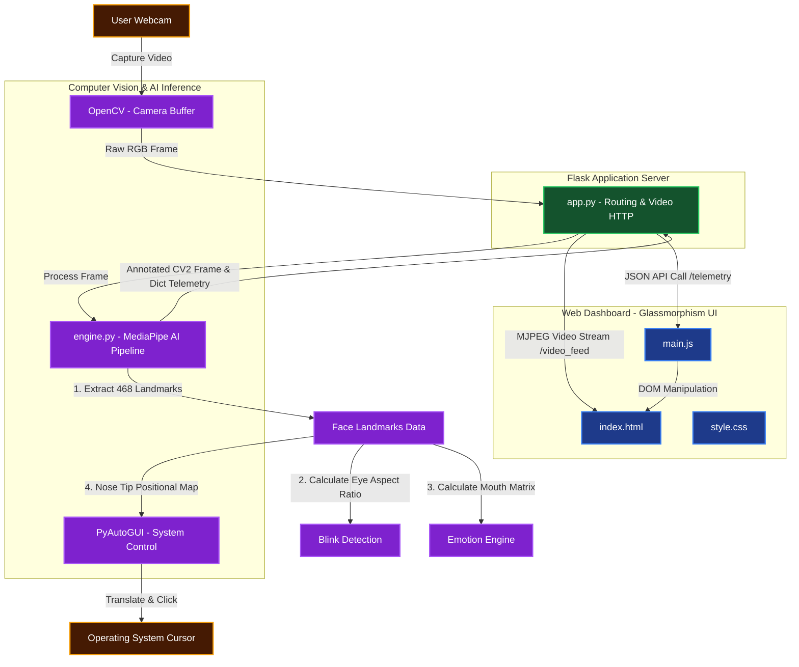
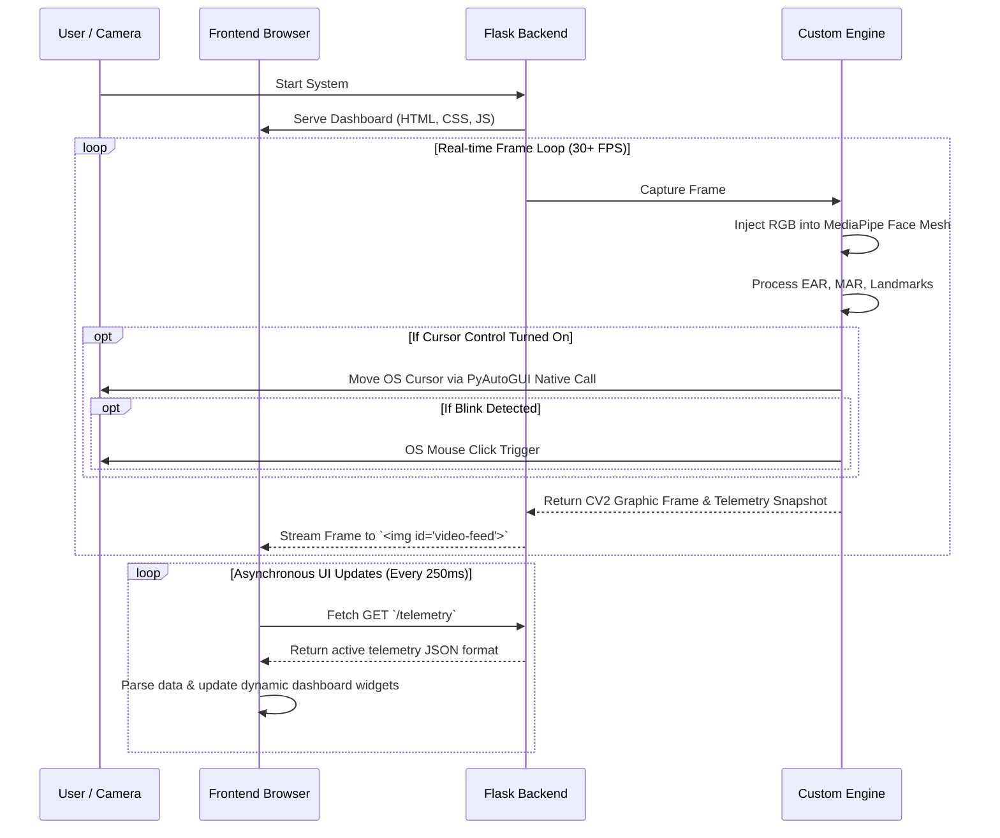

# 🎭 Face Mesh & Emotion Tracking Analytics Dashboard


An advanced, real-time Computer Vision web application that leverages MediaPipe and OpenCV to perform face landmark detection, blink counting, emotion estimation, and interactive cursor control via facial movements.

---

## 🚀 Key Features

* **Real-time 468-Point Face Tracking**: Uses MediaPipe's high-performance Face Mesh AI engine to precisely map facial structure.
* **Blink Detection**: Continuously monitors the Eye Aspect Ratio (EAR) across 12 specific anchor points mapping the eyes to accurately detect and count blinks.
* **Emotion Estimation Heuristics**: Calculates Mouth Aspect Ratio (MAR) and tracks corner lip displacement relative to the center lip to estimate expressions dynamically (Neutral, Happy, Surprised).
* **Nose Cursor Control (Beta)**: Translates your nose tip coordinates to corresponding system mouse movements. If enabled, blinking acts as a mouse click!
* **Glassmorphic Web Dashboard**: An incredibly aesthetic, fully responsive dark-mode UI that streams the webcam feed and reads live telemetry asynchronously.

---

## 🏗️ System Architecture & Data Flow

The system is broken into three main isolated components: The UI layer, the Server/Routing layer, and the AI/Inference Engine. 



---

## 🔄 Sequence Workflow Diagram

This sequence illustrates a complete round-trip across the architecture for every frame visually processed and displayed.



---

## 📁 System Project Structure

```text
c:/Face-Mesh/face-mesh-main/
│
├── app.py                 # Core routing layer, initialization, and CV video streaming
├── engine.py              # Specialized AI Engine - Math calculations & ML inference logic
├── mesh.py                # Base script for raw landmark detection 
├── requirements.txt       # Exhaustive list of python dependencies
│
├── static/
│   ├── main.js            # Frontend JavaScript for AJAX endpoints & Interactions
│   └── style.css          # Next-gen CSS styles (Dark mode + Glassmorphic components)
│
└── templates/
    └── index.html         # Jinja2 Layout & Application UI backbone
```

---

## ⚙️ Local Setup Instructions

Your environment requires a working Python installation (v3.10+ recommended). For the greatest stability, we isolate our project inside a local `venv`.

**1. Generate the Virtual Environment:**
```powershell
python -m venv venv
```

**2. Turn on Virtual Environment:**
```powershell
.\venv\Scripts\activate
```

**3. Install All Dependencies Tracked:**
```powershell
pip install -r requirements.txt
```

**4. Spin up the Analytics Server!**
```powershell
python app.py
```

Finally, visit [http://localhost:5000](http://localhost:5000) inside your web browser. 

---

### *A Note on Cursor Control Failsafes*
*When utilizing the experimental cursor control mechanism, moving your head tracks the mouse. Blinking clicks the mouse. If the cursor becomes erratic, PyAutoGUI FAILSAFE has intentionally been toggled off to avoid application snapping crashes at the physical border resolutions! Simply disable the button inside the web UI to regain immediate hardware mouse control.*
